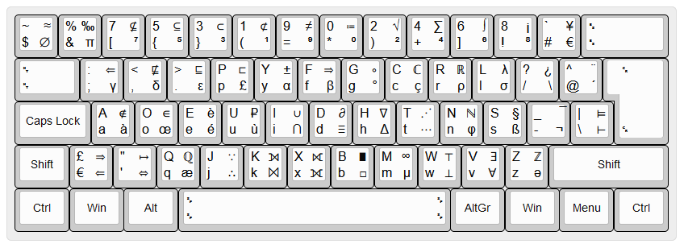

International and Scientific Programmer Dvorak
----------------------------------------------

This keyboard layout is based on the "Programmer Dvorak" layout with
* more accent symbols and diacritical marks, allowing more languages to be typed with ease (e.g., French);
* more mathematical and scientific symbols, such as some Greek letters, numeral superscripts, and logical operators.

The optional characters can provide scientists and mathematicians with quick access to certain symbols they may use frequently, whilst preserving the ease of typing with the programmer Dvorak layout. (Note that some characters that were accessible using the Alt modifyer key may have been moved.)

The placing of some characters and symbols has been chosen to make them easier to remember (as much as possible). For example, the "for all" operator is located on the "V" key, as it has the same shape. The "exist" operator is located on the same key as it is related to the "for all" operator. The tilde and almost equal operator are also located on the same key, as their shapes resemble each other. Symbols representing sets of numbers (e.g., N and Z) have been located on the keys with the same name. The "intersection" is put on the "i" key. The GBP symbol is located on the "p" key, whereas the paragraph sign is located on the "s", as this is the shape it resembles most.

As not all accentuated letters could be added, the acute, grave, circumflex, diaeresis, and tilde have been added. 

In all fairness, mapping these symbols to keys happens in a best-effort manner, but it will never be perfect and improvements can always be made. For example, the diaresis is typed using Alt Gr and Shift, making it not easily accessible for German speakers. Also the choice of characters to add in the layout is a choice which can never be perfect. Are the square root and integration symbol used often, for example? Suggestions for improvements are of course welcomed.

Made with Microsoft Keyboard Layout Creator 1.4.

